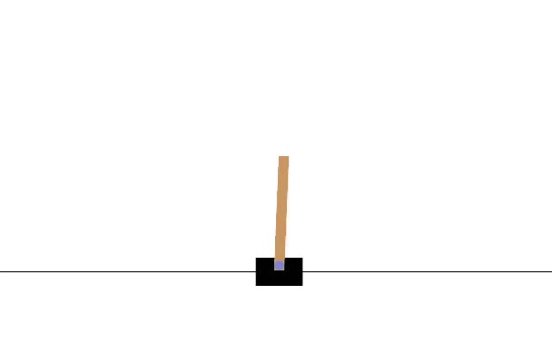
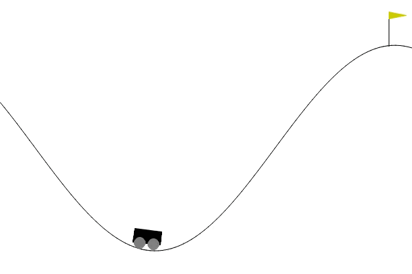
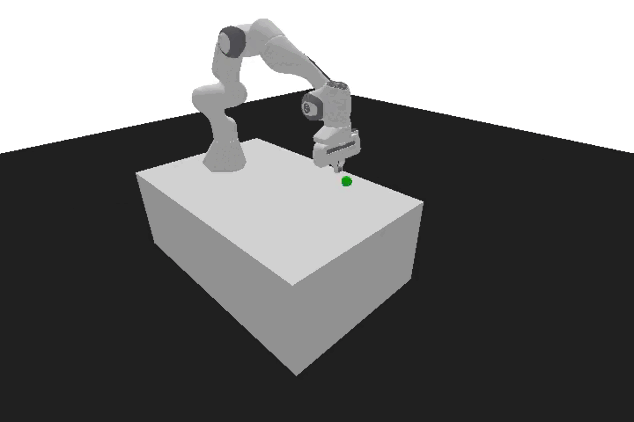

# Reinforcement Learning

__Language__: English, [Русский](read.md)

## Technologies
* Pytorch
* Stable-baselines3
* Gym
* Numpy
* Hugging Face

## Pixel Copter


__Training Parameters__:

For training, a deep Q-learning neural network was utilized, written using the PyTorch library:
```Python
class Policy(nn.Module):
  def __init__(self, s_size, a_size, h_size):
    super(Policy, self).__init__()
    # Defining the neural network architecture
    self.fc1 = nn.Linear(s_size, h_size)
    self.fc2 = nn.Linear(h_size, h_size*2)
    self.fc3 = nn.Linear(h_size*2, a_size)
    
  def forward(self, x):
    # Forward pass through the neural network with ReLU activation function
    x = F.relu(self.fc1(x))
    x = F.relu(self.fc2(x))
    x = self.fc3(x)
    # Returning the action probability distribution with Softmax activation
    return F.softmax(x, dim=1)
    
  def act(self, state):
    # Transforming the state into a format compatible with the neural network
    # and adding an additional dimension using unsqueeze(0) to pass a single state through the network as a batch of one state
    state = torch.from_numpy(state).float().unsqueeze(0).to(device)
    # Calculating action probabilities using the neural network
    probs = self.forward(state).cpu()
    # Creating a Categorical object to work with the probability distribution
    m = Categorical(probs)
    # Choosing an action randomly. The probability of choosing each action corresponds to the probability predicted by the neural network
    action = m.sample()
    # Returning the numerical value of the action using action.item() since action is a tensor
    return action.item(), m.log_prob(action)
```
For training, the Reinforce method, based on Monte Carlo, was used:
```Python
# Function for training using the Reinforce (Monte Carlo) method
def reinforce(policy, optimizer, n_training_episodes, max_t, gamma, print_every):

    scores_deque = deque(maxlen=100)
    scores = []
    # Iterating through training episodes
    for i_episode in range(1, n_training_episodes+1):
        saved_log_probs = []
        rewards = []
        # Starting a new episode: resetting the environment and obtaining the initial state
        state = env.reset()
        # Iterating within the current episode with a maximum number of steps, max_t
        for t in range(max_t):
            # Getting action and its logarithmic probability from the policy
            action, log_prob = policy.act(state)
            saved_log_probs.append(log_prob)
            # The step method takes the action as an argument and returns information about the environment's state
            state, reward, done, _ = env.step(action)
            rewards.append(reward)
            # If the episode is done, break the iteration
            if done:
                break
        scores_deque.append(sum(rewards))
        scores.append(sum(rewards))

        # 'returns' will store information about future rewards over a certain number of time steps
        returns = deque(maxlen=max_t)
        n_steps = len(rewards)
    
        for t in range(n_steps)[::-1]:
            disc_return_t = (returns[0] if len(returns) > 0 else 0)
            # Calculating the discounted return for the current step
            returns.appendleft(gamma * disc_return_t + rewards[t])

        # Returns the smallest positive number
        eps = np.finfo(np.float32).eps.item()

        # Normalizing returns and preparing for loss calculation
        returns = torch.tensor(returns)
        returns = (returns - returns.mean()) / (returns.std() + eps)

        policy_loss = []
        for log_prob, disc_return in zip(saved_log_probs, returns):
            # When computing the loss for updating the agent's policy, the negative value of logarithmic probabilities is used
            # (the Monte Carlo method maximizes the expected reward, so the loss is defined as a negative value to minimize)
            policy_loss.append(-log_prob * disc_return)
        # Concatenating and summing the losses
        policy_loss = torch.cat(policy_loss).sum()

        # Zeroing gradients of all parameters
        optimizer.zero_grad()
        # Performing backpropagation
        policy_loss.backward()
        # Performing backpropagation
        optimizer.step()

        if i_episode % print_every == 0:
            print('Episode {}\tAverage Score: {:.2f}'.format(i_episode, np.mean(scores_deque)))

    return scores
```

Set the training parameters:
```Python
pixelcopter_hyperparameters = {
    "h_size": 64,
    "n_training_episodes": 50000,
    "n_evaluation_episodes": 10,
    "max_t": 10000,
    "gamma": 0.99,
    "lr": 1e-4,
    "env_id": env_id,
    "state_space": s_size,
    "action_space": a_size,
}
pixelcopter_policy = Policy(pixelcopter_hyperparameters["state_space"], pixelcopter_hyperparameters["action_space"], pixelcopter_hyperparameters["h_size"]).to(device)
pixelcopter_optimizer = optim.Adam(pixelcopter_policy.parameters(), lr=pixelcopter_hyperparameters["lr"])
scores = reinforce(pixelcopter_policy,
                   pixelcopter_optimizer,
                   pixelcopter_hyperparameters["n_training_episodes"],
                   pixelcopter_hyperparameters["max_t"],
                   pixelcopter_hyperparameters["gamma"],
                   1000)
```
__Model Evaluation__: ```Mean reward: 27.90 +/- 27.14```

[Hugging Face](https://huggingface.co/kowalsky/Reinforce-PixelCopter): link to the model.

## Cartpole


The agent was trained using the Monte Carlo method with a neural network consisting of two layers: input and output. This method was adjusted considering various training and hyperparameters, including:
```Python
cartpole_hyperparameters = {
    "h_size": 16,
    "n_training_episodes": 1100,
    "n_evaluation_episodes": 10,
    "max_t": 1000,
    "gamma": 1.0,
    "lr": 1e-2,
    "env_id": env_id,
    "state_space": s_size,
    "action_space": a_size,
}
cartpole_policy = Policy(cartpole_hyperparameters['state_space'], cartpole_hyperparameters['action_space'], cartpole_hyperparameters['h_size']).to(device)
cartpole_optimizer = optim.Adam(cartpole_policy.parameters(), lr = cartpole_hyperparameters['lr'])
scores = reinforce(cartpole_policy,
                   cartpole_optimizer,
                   cartpole_hyperparameters["n_training_episodes"],
                   cartpole_hyperparameters["max_t"],
                   cartpole_hyperparameters["gamma"],
                   100)
```
__Model Evaluation__: ```Mean reward: 500.00 +/- 0.00```

[Hugging Face](https://huggingface.co/kowalsky/Reinforce-CartPole-v1): link to the model.

## Lunar Lander


During training, the Proximal Policy Optimization (PPO) algorithm was used. PPO combines both value-based reinforcement learning and policy-based reinforcement learning methods.

__Training Parameters__:
```Python
model = PPO(
    policy = 'MlpPolicy',
    env = env,
    n_steps = 1024,
    batch_size = 64,
    n_epochs = 4,
    gamma = 0.999,
    gae_lambda = 0.98,
    ent_coef = 0.01,
    verbose=1)

model.learn(total_timesteps=1000000)
```
__Model Evaluation__: ```mean_reward=268.75 +/- 19.63485389637082```

[Hugging Face](https://huggingface.co/kowalsky/LunarLander-v2): link to the model.

## Mountain Car


Initially, the Proximal Policy Optimization (PPO) algorithm was chosen for training the agent. However, during experimentation and fine-tuning of training parameters, it became evident that the selected PPO parameters did not yield the desired results. As a result of this experience, a decision was made to switch to the DQN (Deep Q-Network) algorithm.

__Training Parameters__:
```Python
model = DQN(
      policy="MlpPolicy",
      env=env,
      learning_rate=1e-3,
      buffer_size=50000,
      exploration_fraction=0.1,
      exploration_final_eps=0.1,
  )

model.learn(total_timesteps=500000)
```

__Model Evaluation__: ```Mean reward: -163.90 +/- 36.20```

[Hugging Face](https://huggingface.co/kowalsky/MountainCar-v0): link to the model.

## Robot


For training, the Actor Advantage Critic (A2C) model was utilized. The actor-critic model takes states as input and generates two outputs:

1. An estimation of the total future rewards starting from the current state, excluding the current reward already obtained.
2. A recommendation for the action to take (policy).

__Training Parameters__:
```Python
# A wrapper is used for normalizing (standardizing) both observations and rewards.
env = VecNormalize(env, norm_obs=True, norm_reward=True, clip_obs=10.)
model = A2C(policy="MultiInputPolicy", env=env, verbose=1)
model.learn(1_000_000)
```

__Model Evaluation__: ```Mean reward = -0.18 +/- 0.12```

[Hugging Face](https://huggingface.co/kowalsky/a2c-PandaReachDense-v3): link to the model.

## Space Invaders


For training, a deep Q-learning neural network from the Stable-Baselines3 library was used. Training was conducted on the SpaceInvadersNoFrameskip-v4 environment using the DQN algorithm:
```Python
!python -m rl_zoo3.train --algo dqn  --env SpaceInvadersNoFrameskip-v4 -f logs/ -c dqn.yml
```
__Model Evaluation__: ```Mean reward: 490.00 +/- 137.33```

[Hugging Face](https://huggingface.co/kowalsky/SpaceInvaders-v4): link to the model.

## Frozen Lake


For training the agent, the Q-learning method for learning the Q-function was utilized:
```Python
# Initialization of an empty table with the size: env.observation_space.n x env.action_space.n.
def initialize_q_table(state_space, action_space):
    Qtable = np.zeros((state_space, action_space))
    return Qtable

Qtable_frozenlake = initialize_q_table(state_space, action_space)

# Greedy strategy: the agent always chooses the action with the highest Q-value
def greedy_policy(Qtable, state):
    action = np.argmax(Qtable[state][:])
    return action

# Epsilon-greedy strategy: combines greedy exploitation and exploration
def epsilon_greedy_policy(Qtable, state, epsilon):
    # Generate a random number between 0 and 1
    random_num = random.uniform(0,1)
    # If the random number is greater than epsilon, the agent follows the greedy strategy (exploitation)
    if random_num > epsilon:
        action = greedy_policy(Qtable, state)
    # Otherwise, the agent explores and chooses a random action from the environment's action space
    else:
        action = env.action_space.sample()

    return action
```
__Training Parameters__:

```Python
n_training_episodes = 10000 
learning_rate = 0.7
n_eval_episodes = 100
env_id = "FrozenLake-v1"
max_steps = 99               # Maximum number of steps per episode
gamma = 0.95                 # The discount factor
eval_seed = []

max_epsilon = 1.0            # The initial exploration probability at the start of training
min_epsilon = 0.05           # The minimum exploration probability
decay_rate = 0.0005          # The rate at which the exploration probability decreases exponentially over time during training
```
__Train function__:
```Python
def train(n_training_episodes, min_epsilon, max_epsilon, decay_rate, env, max_steps, Qtable):
    # Using the tqdm library to track progress
    for episode in tqdm(range(n_training_episodes)):
        # Decreasing epsilon to reduce exploration probability
        epsilon = min_epsilon + (max_epsilon - min_epsilon)*np.exp(-decay_rate*episode)
        # Resetting the environment to the initial state
        state, info = env.reset()
        step = 0
        terminated = False
        truncated = False

        for step in range(max_steps):
        # Choosing an action using an epsilon-greedy strategy
        action = epsilon_greedy_policy(Qtable, state, epsilon)

        # The method takes an action and returns the environment's state
        new_state, reward, terminated, truncated, info = env.step(action)

        # Updating the table values
        Qtable[state][action] = Qtable[state][action] + learning_rate * (reward + gamma * np.max(Qtable[new_state]) - Qtable[state][action])

        if terminated or truncated:
            break

        # Setting the new state
        state = new_state
    return Qtable
```
__Model Evaluation__: ```Mean reward: 1.00 +/- 0.00```

[Hugging Face](https://huggingface.co/kowalsky/q-FrozenLake-v1-4x4-noSlippery): link to the model.

## Taxi


When training this agent, the Q-learning method was also used, but with different parameters:
```Python
n_training_episodes = 25000
learning_rate = 0.7

n_eval_episodes = 100

env_id = "Taxi-v3"
max_steps = 99
gamma = 0.95

max_epsilon = 1.0
min_epsilon = 0.05
decay_rate = 0.005
```
__Model Evaluation__: ```Mean reward: 7.48 +/- 2.73```

[Hugging Face](https://huggingface.co/kowalsky/Taxi-v3): link to the model.
____
__All model training was conducted using the Google Colab service__
