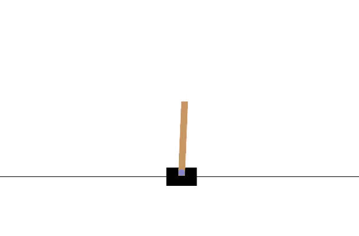
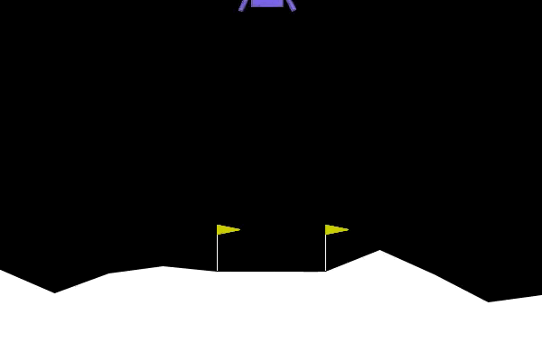
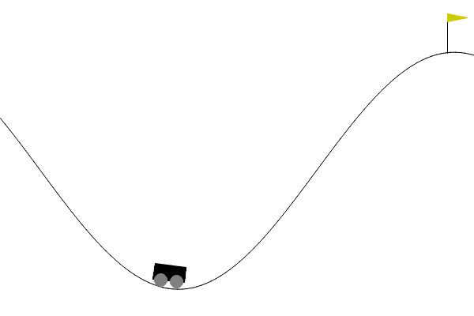
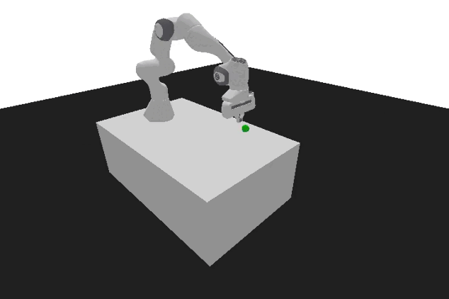
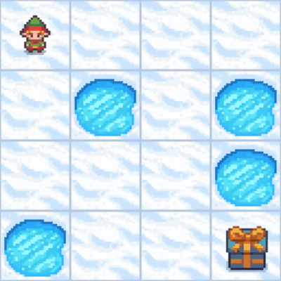
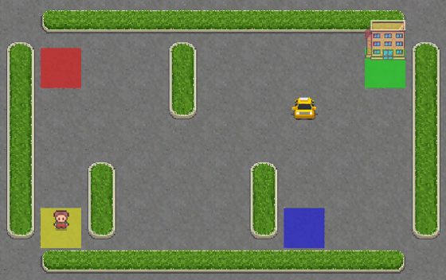

# Обучение с подкреплением (Reinforcement Learning)

Language: [English](README.md), Русский

## Инструменты и технологии
* Pytorch
* Stable-baselines3
* Gym
* Numpy
* Hugging Face

## Pixel Copter


__Параметры обучения__:

Для обучения была использована глубокая нейросеть Q-обучения, написанная с использованием бибилотеки Pytorch:
```Python
class Policy(nn.Module):
  def __init__(self, s_size, a_size, h_size):
    super(Policy, self).__init__()
    # Определение архитектуры нейронной сети
    self.fc1 = nn.Linear(s_size, h_size)
    self.fc2 = nn.Linear(h_size, h_size*2)
    self.fc3 = nn.Linear(h_size*2, a_size)
    
  def forward(self, x):
    # Прямой проход через нейронную сеть с функцией активации ReLU
    x = F.relu(self.fc1(x))
    x = F.relu(self.fc2(x))
    x = self.fc3(x)
    # Возвращаем распределение вероятностей действий с функцией активации Softmax
    return F.softmax(x, dim=1)
    
  def act(self, state):
    # Преобразуем состояние в совместимый с нейронной сетью формат и добавляем дополнительное измерение с помощью unsqueeze(0),
    # что позволяет передавать одиночное состояние через сеть как батч (пакет) из одного состояния
    state = torch.from_numpy(state).float().unsqueeze(0).to(device)
    # Подсчет вероятностей действий с помощью нейронной сети
    probs = self.forward(state).cpu()
    # Создаем объект Categorical для работы с распределением вероятностей
    m = Categorical(probs)
    # Выбираем действие случайным образом. Вероятность выбора каждого действия соответствует вероятности, предсказанной нейронной сетью
    action = m.sample()
    # Возвращаем числовое значение действия командой action.item(), так как action является тензором
    return action.item(), m.log_prob(action)
```
Для обучения использовался метод Монте-Карло (Reinforce):
```Python
# Функция для обучения с использованием метода Монте-Карло (Reinforce)
def reinforce(policy, optimizer, n_training_episodes, max_t, gamma, print_every):

    scores_deque = deque(maxlen=100)
    scores = []
    # Начало итерации по эпизодам обучения
    for i_episode in range(1, n_training_episodes+1):
        saved_log_probs = []
        rewards = []
        # Начало нового эпизода: сброс среды и получение начального состояния
        state = env.reset()
        # Итерация внутри текущего эпизода с максимальным количеством шагов max_t
        for t in range(max_t):
            # Получаем действие и его логарифмическую вероятность из политики
            action, log_prob = policy.act(state)
            saved_log_probs.append(log_prob)
            # Метод step принимает действие (action) в качестве аргумента и возвращает информацию о состоянии среды
            state, reward, done, _ = env.step(action)
            rewards.append(reward)
            # Если эпизод завершился, прекращаем итерацию
            if done:
                break
        scores_deque.append(sum(rewards))
        scores.append(sum(rewards))

        # returns будет хранить информацию о будущих вознаграждениях в течение определенного количества временных шагов
        returns = deque(maxlen=max_t)
        n_steps = len(rewards)
    
        for t in range(n_steps)[::-1]:
            disc_return_t = (returns[0] if len(returns) > 0 else 0)
            # Вычисляем дисконтированный возврат для текущего шага
            returns.appendleft(gamma * disc_return_t + rewards[t])

        # Возвращает наименьшее положительное число
        eps = np.finfo(np.float32).eps.item()

        # Нормализация возвратов и подготовка к вычислению потери
        returns = torch.tensor(returns)
        returns = (returns - returns.mean()) / (returns.std() + eps)

        policy_loss = []
        for log_prob, disc_return in zip(saved_log_probs, returns):
            # При вычислении потери для обновления политики агента используется отрицательное значение логарифма вероятностей
            # (метод Монте-Карло максимизирует ожидаемую награду, поэтому потеря определяется как отрицательная величина, которую нужно минимизировать)
            policy_loss.append(-log_prob * disc_return)
        # Объединяем и суммируем потери
        policy_loss = torch.cat(policy_loss).sum()

        # Обнуляем градиенты всех параметров
        optimizer.zero_grad()
        # Выполняем обратное распространение (backpropagation)
        policy_loss.backward()
        # Выполняем шаг оптимизации
        optimizer.step()

        if i_episode % print_every == 0:
            print('Episode {}\tAverage Score: {:.2f}'.format(i_episode, np.mean(scores_deque)))

    return scores
```

Далее задаём параметры обучения:
```Python
pixelcopter_hyperparameters = {
    "h_size": 64,
    "n_training_episodes": 50000,
    "n_evaluation_episodes": 10,
    "max_t": 10000,
    "gamma": 0.99,
    "lr": 1e-4,
    "env_id": env_id,
    "state_space": s_size,
    "action_space": a_size,
}
pixelcopter_policy = Policy(pixelcopter_hyperparameters["state_space"], pixelcopter_hyperparameters["action_space"], pixelcopter_hyperparameters["h_size"]).to(device)
pixelcopter_optimizer = optim.Adam(pixelcopter_policy.parameters(), lr=pixelcopter_hyperparameters["lr"])
scores = reinforce(pixelcopter_policy,
                   pixelcopter_optimizer,
                   pixelcopter_hyperparameters["n_training_episodes"],
                   pixelcopter_hyperparameters["max_t"],
                   pixelcopter_hyperparameters["gamma"],
                   1000)
```
__Оценка модели__: ```Mean reward: 27.90 +/- 27.14```

[Hugging Face](https://huggingface.co/kowalsky/Reinforce-PixelCopter): ссылка на модель.

## Cartpole


Для обучения агента был применен метод Монте-Карло, в рамках которого использовалась нейронная сеть с двумя слоями: входным и выходным. Этот метод был настроен с учетом ряда параметров обучения и гиперпараметров, включая:
```Python
cartpole_hyperparameters = {
    "h_size": 16,
    "n_training_episodes": 1100,
    "n_evaluation_episodes": 10,
    "max_t": 1000,
    "gamma": 1.0,
    "lr": 1e-2,
    "env_id": env_id,
    "state_space": s_size,
    "action_space": a_size,
}
cartpole_policy = Policy(cartpole_hyperparameters['state_space'], cartpole_hyperparameters['action_space'], cartpole_hyperparameters['h_size']).to(device)
cartpole_optimizer = optim.Adam(cartpole_policy.parameters(), lr = cartpole_hyperparameters['lr'])
scores = reinforce(cartpole_policy,
                   cartpole_optimizer,
                   cartpole_hyperparameters["n_training_episodes"],
                   cartpole_hyperparameters["max_t"],
                   cartpole_hyperparameters["gamma"],
                   100)
```
__Оценка модели__: ```Mean reward: 500.00 +/- 0.00```

[Hugging Face](https://huggingface.co/kowalsky/Reinforce-CartPole-v1): ссылка на модель.

## Lunar Lander


При обучении использовался алгоритм Proximal Policy Optimization (PPO). PPO комбинирует в себе метод обучения с подкреплением на основе оценки значения (Value-based) и метод обучения с подкреплением на основе политики (Policy-based).

__Параметры обучения__:
```Python
model = PPO(
    policy = 'MlpPolicy',
    env = env,
    n_steps = 1024,
    batch_size = 64,
    n_epochs = 4,
    gamma = 0.999,
    gae_lambda = 0.98,
    ent_coef = 0.01,
    verbose=1)

model.learn(total_timesteps=1000000)
```
__Оценка модели__: ```mean_reward=268.75 +/- 19.63485389637082```

[Hugging Face](https://huggingface.co/kowalsky/LunarLander-v2): ссылка на модель.

## Mountain Car


Изначально для обучения агента был выбран алгоритм Proximal Policy Optimization (PPO). Однако, в ходе исследования и настройки параметров обучения, стало ясно, что выбранные параметры PPO не привели к желаемым результатам. В результате этого опыта было принято решение переключиться на алгоритм DQN (глубокая сеть Q-обучения).

__Параметры обучения__:
```Python
model = DQN(
      policy="MlpPolicy",
      env=env,
      learning_rate=1e-3,
      buffer_size=50000,
      exploration_fraction=0.1,
      exploration_final_eps=0.1,
  )

model.learn(total_timesteps=500000)
```

__Оценка модели__: ```Mean reward: -163.90 +/- 36.20```

[Hugging Face](https://huggingface.co/kowalsky/MountainCar-v0): ссылка на модель.

## Robot


Для обучения использовалась модель Actor Advantage Critic (A2C). Модель _субъект-критик_ принимает на вход состояния и генерирует два выхода:
1. Оценка того, сколько вознаграждения будет получено, начиная с момента текущего состояния, за исключением текущего (уже имеющегося) вознаграждения.
2. Рекомендацию, какое действие предпринять (политика)

__Параметры обучения__:
```Python
# Обертка (wrapper) используется для нормализации (стандартизации) как наблюдений (jbservation), так и наград (reward)
env = VecNormalize(env, norm_obs=True, norm_reward=True, clip_obs=10.)
model = A2C(policy="MultiInputPolicy", env=env, verbose=1)
model.learn(1_000_000)
```

__Оценка модели__: ```Mean reward = -0.18 +/- 0.12```

[Hugging Face](https://huggingface.co/kowalsky/a2c-PandaReachDense-v3): ссылка на модель.

## Space Invaders


Для обучения была использована глубокая нейросеть Q-обучения библиотеки Stable-Baselines3. Обучение проводилось на окружении SpaceInvadersNoFrameskip-v4 с использованием алгоритма DQN:
```Python
!python -m rl_zoo3.train --algo dqn  --env SpaceInvadersNoFrameskip-v4 -f logs/ -c dqn.yml
```
__Оценка модели__: ```Mean reward: 490.00 +/- 137.33```

[Hugging Face](https://huggingface.co/kowalsky/SpaceInvaders-v4): ссылка на модель.

## Frozen Lake


Для обучения агента использовался метод обучения Q-функции:
```Python
# Инициализация пустой таблицы размером: env.observation_space.n x env.action_space.n
def initialize_q_table(state_space, action_space):
    Qtable = np.zeros((state_space, action_space))
    return Qtable

Qtable_frozenlake = initialize_q_table(state_space, action_space)

# Жадная стратегия: агент всегда выбирает действие с наивысшим  занчением Q-функции
def greedy_policy(Qtable, state):
    action = np.argmax(Qtable[state][:])
    return action

# Эпсилон-жадная стратегия: комбинирует жадное поведение (exploitation) и исследование (exploration)
def epsilon_greedy_policy(Qtable, state, epsilon):
    # Генерируем случайное число между 0 и 1
    random_num = random.uniform(0,1)
    # Если случайное число больше epsilon, агент придерживается жадной стратегии (эксплуатации)
    if random_num > epsilon:
        action = greedy_policy(Qtable, state)
    # В противном случае агент исследует (exploration) и выбирает случайное действие из пространства действий среды
    else:
        action = env.action_space.sample()

    return action
```
__Параметры обучения__:

```Python
n_training_episodes = 10000 
learning_rate = 0.7
n_eval_episodes = 100
env_id = "FrozenLake-v1"
max_steps = 99               # максимальное количество шагов за эпизод
gamma = 0.95                 # коэффициент дисконтирования
eval_seed = []

max_epsilon = 1.0            # Вероятность исследования в начале обучения
min_epsilon = 0.05           # Минимальная вероятность исследования
decay_rate = 0.0005          # Экспоненциальная скорость убывания вероятности исследования
```
__Функция обучения__:
```Python
def train(n_training_episodes, min_epsilon, max_epsilon, decay_rate, env, max_steps, Qtable):
    # Использование библиотеки tqdm для отслеживания прогресса
    for episode in tqdm(range(n_training_episodes)):
        # Уменьшаем epsilon для уменьшения вероятности исследования
        epsilon = min_epsilon + (max_epsilon - min_epsilon)*np.exp(-decay_rate*episode)
        # Сбрасываем среду в начальное состояние
        state, info = env.reset()
        step = 0
        # Эпизод завершился
        terminated = False
        # Эпизод прервался
        truncated = False

        for step in range(max_steps):
        # Выбираем действие с использованием эпсилон-жадной стратегии
        action = epsilon_greedy_policy(Qtable, state, epsilon)

        # Метод принимает действие и возвращает состояние среды
        new_state, reward, terminated, truncated, info = env.step(action)

        # Обновляем значения таблицы
        Qtable[state][action] = Qtable[state][action] + learning_rate * (reward + gamma * np.max(Qtable[new_state]) - Qtable[state][action])

        if terminated or truncated:
            break

        # Задаём новое состояние
        state = new_state
    return Qtable
```
__Оценка модели__: ```Mean reward: 1.00 +/- 0.00```

[Hugging Face](https://huggingface.co/kowalsky/q-FrozenLake-v1-4x4-noSlippery): ссылка на модель.

## Taxi


При обучении данного агента также использовался метод обучения Q-функции, но с другими параметрами:
```Python
n_training_episodes = 25000
learning_rate = 0.7

n_eval_episodes = 100

env_id = "Taxi-v3"
max_steps = 99
gamma = 0.95

max_epsilon = 1.0
min_epsilon = 0.05
decay_rate = 0.005
```
__Оценка модели__: ```Mean reward: 7.48 +/- 2.73```

[Hugging Face](https://huggingface.co/kowalsky/Taxi-v3): ссылка на модель.
____
__Обучение всех моделей было проведено в сервисе Google Colab__